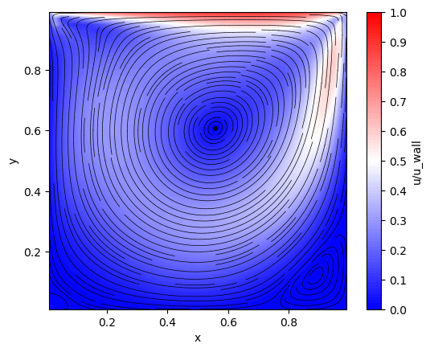
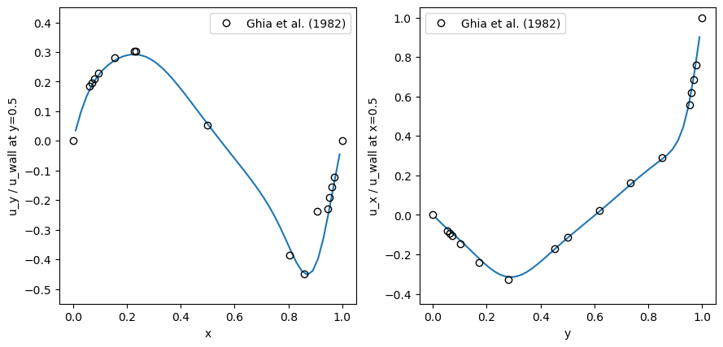

# Overview

This is a collection of simulators using Lattice Boltzman Method. Currently, the following simulators are implemented:

- 2-D Poiseuille flow
- 2-D cavity flow

The following collision models are implemented:

- Single relaxation time (SRT) model
- Multiple relaxation time (MRT) model
- Central Moment (CM) model (not yet verified)

# How to Build

CMake is required to build programs. Please run the following commands under the root directory:

```terminal
$ cmake -B build -S .
$ cmake --build build
```

# How to Run

Please type the following commands under the project root directory to run LBM simulators:

```terminal
$ ./build/lbm-simulator poiseuille -f data/poiseuille.json
$ ./build/lbm-simulator cavity -f data/cavity.json
```

JSON files under the `data` directory are input files for each simulator.
An example of the input JSON file for the `poiseuille` simulator is:

```yaml
{
    // Number of grids
    "gridShape": [
        21, // X
        21  // Y
    ],
    // External force vector
    // Constant and uniform in the region
    "externalForce": [
        0.00001, // X
        0.0      // Y
    ],
    // Parameters for SRT model
    "singleRelaxationTimeModel": {
        "tau": 0.56
    },
    // Criteria to end while-loops
    "errorLimit": 1e-10,
    "printFrequency": 5000,
    "maxIteration": 1000000,
    // Directory to output result data (ux.txt, y.txt)
    "outputDirectory": "./result/poiseuille"
}
```

If you want to use the MRT or CM model, replace `singleRelaxationTimeModel` element with

```yaml
"multipleRelaxationTimeModel": {
    "se": 1.5,
    "sq": 1.5,
    "seps": 1.4,
    "tau": 0.56,
}
```

or

```yaml
"centralMomentModel": {
    "relaxationMatrix": [1.0, 1.0, 1.0, 1.0, 1.75, 1.75, 1.0, 1.0, 1.0]
}
```

An example of the input JSON file for the `cavity` simulator is:

```yaml
{
    "gridShape": [
        52,
        52
    ],
    // Wall velocity of the top boundary
    "wallVelocity": 0.1,
    "singleRelaxationTimeModel": {
        "tau": 0.65
    },
    "errorLimit": 1e-10,
    "printFrequency": 10000,
    "maxIteration": 50000,
    // Directory to output result data (ux.txt, uy.txt, x.txt, y.txt)
    "outputDirectory": "./result/cavity"
}
```

`multileRelaxationTimeModel` can be also used as well as in the `poiseuille` simulator.

# Results

## 2-D Cavity Flow

### MRT Model

Re = 400.






# References

[1] V.Ghia, K.N.Ghia and C.T.Shin. 1982. "High-Re solutions for incompressible flow using the Navier-Stokes equations and a multi-grid method", _J. Comp. Phys._, vol. 48, pp. 387-411

